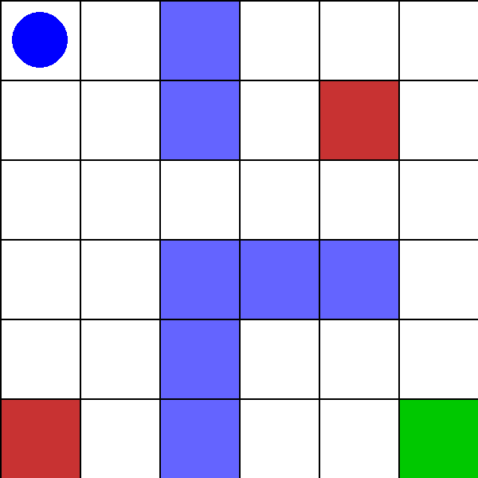
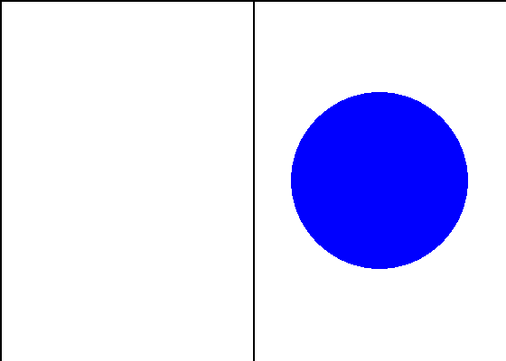
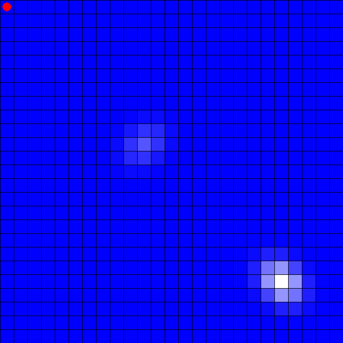

### Submitter: CJ Jones

## Part 0: Package Reload and Imports

```{python}
%load_ext autoreload
%autoreload 2
```

```{python}
from gymnasium.envs.registration import register
import gymnasium as gym
from gymnasium.utils.env_checker import check_env
import numpy as np
import matplotlib.pyplot as plt

# !uv build
# !uv pip install . e

import src.rl_hw_01.envs.simple_gridworld as boat_grid
import src.rl_hw_01.envs.expanded_gridworld as expanded_grid
import src.rl_hw_01.envs.geosearch_gridworld as geosearch_grid

import src.rl_hw_01.agents.simple_gridworld_qvalue_agent as sgqva
import src.rl_hw_01.agents.simple_gridworld_dynamic_agent as sgda
import src.rl_hw_01.agents.simple_gridworld_mc_agent as sgmca

import src.rl_hw_01.agents.expanded_gridworld_dynamic_agent as egda
import src.rl_hw_01.agents.expanded_gridworld_mc_agent as egmca
import src.rl_hw_01.agents.expanded_gridworld_qvalue_agent as egqa

import src.rl_hw_01.agents.geosearch_gridworld_dynamic_agent as ggda
import src.rl_hw_01.agents.geosearch_gridworld_mc_agent as ggmca

import src.rl_hw_01.visualizations.simple_gridworld_visualizations as sgv
```

## Part 1: Boat in a Simple GridWorld

The simple boat grid world problem involves navigating a boat across a grid like ocean, where the agent must reach a goal by choosing from the actions of move left or right while contending with environmental dynamics of wind. The environment assigns rewards or penalties based on the agent's movements and outcomes, requiring the agent to learn an optimal policy to maximize its total rewards while overcoming stochastic transitions.

### Part 1.1: Setup and Register Environments

First register the environments that will be created for the different RL training algorithms. Then pass a quick check to make sure that the environment created to model the boat world problem conforms with standard gymnasium class requirements to ensure proper updating and environment steps.

```{python}
# BOAT GRIDWORLD

register(
    id="gymnasium_env/GridWorldEnvCJ-Check",
    entry_point=boat_grid.GridWorldEnvCJ,
    max_episode_steps=100
)

register(
    id="gymnasium_env/GridWorldEnvCJ-Visualize",
    entry_point=boat_grid.GridWorldEnvCJ,
    max_episode_steps=100
)

register(
    id="gymnasium_env/GridWorldEnvCJ-Dynamic",
    entry_point=boat_grid.GridWorldEnvCJ,
    max_episode_steps=100
)

register(
    id="gymnasium_env/GridWorldEnvCJ-MC",
    entry_point=boat_grid.GridWorldEnvCJ,
    max_episode_steps=100
)

register(
    id="gymnasium_env/GridWorldEnvCJ-TD",
    entry_point=boat_grid.GridWorldEnvCJ,
    max_episode_steps=100
)

# EXPANDED GRIDWORLD

register(
    id="gymnasium_env/GridWorldEnvCJ-ExpandedCheck",
    entry_point=expanded_grid.GridWorldExpandedEnvCJ,
    max_episode_steps=100
)

# GEOSEARCH GRIDWORLD

register(
    id="gymnasium_env/GeoSearchEnvCJ",
    entry_point=geosearch_grid.GeoSearchEnvCJ,
    max_episode_steps=300
)
```

```{python}
seed = 42

env = gym.make("gymnasium_env/GridWorldEnvCJ-Check", render_mode="none", width=2, height=1)  # pass kwargs here
obs, info = env.reset(seed=seed)

try:
    check_env(env)
    print("Environment passes all checks!")
except Exception as e:
    print(f"Environment has issues: {e}")
```

### Part 1.2: Visualize the boat (a blue dot) moving through the environments with random actions

Here with a completely random policy of choosing actions we can visualize the agent moving through the environment. In this demo only 15 steps are showing so it is difficult to get a total sense of environmental conditions, in later training steps will be simulated tens of thousands of times.

```{python}
env_visualize = gym.make("gymnasium_env/GridWorldEnvCJ-Visualize", render_mode="human", width=2, height=1, verbose = False)  # pass kwargs here

obs, info = env_visualize.reset(seed=seed)
rng = env_visualize.unwrapped.np_random

for _ in range(15):
    action = int(rng.integers(env_visualize.action_space.n))
    obs, reward, terminated, truncated, info = env_visualize.step(action=action)
    print(f"Step {_}: Action Taken: {action}, Observation: {obs}, Reward: {reward}")
    if terminated or truncated:
        print("\033[91m" + "Terminated!" + "\033[0m\n")
        obs, info = env_visualize.reset()

env_visualize.close()
```

### Part 1.3: Simulating the Boat World with Dynamic Programming

#### Dynamic Programming Intro
In the Dynamic Programming setup for the Boat's simple gridworld, the goal is to generate an approximation of the probability transition matrix by running steps of the environment and then counting the observed state changes. Then using that transition probability table approximation generate the optimal plan via solving the bellman equation for the various states.

```{python}
dynamic_env_width = 2
dynamic_env_height = 1

env_learned_dynamic = gym.make("gymnasium_env/GridWorldEnvCJ-Dynamic",
                                render_mode="none",
                                width=dynamic_env_width,
                                height=dynamic_env_height,
                                verbose=False)

agent_learned = sgda.SimpleGridWorldDynamicAgent(env_learned_dynamic, model_source="learned")

# collect experience with good coverage
P_hat, R_hat, N = agent_learned.estimate_model(
    episodes=4000, max_steps=50,
    behavior="epsilon_greedy", epsilon=0.3,
    seed=123, smooth_dirichlet=0.1,
    verbose=True, print_every=500
)

V_hat, pi_hat = agent_learned.fit()

print("\nOptimal V(s) via learned model:\n",
      V_hat.reshape(dynamic_env_height, dynamic_env_width))
print("Optimal policy via learned model:\n", pi_hat,
        "\nCorresponding actual movements (action vectors):\n",
        [[1, 0] if action == 0 else [-1, 0] for action in pi_hat]
        )

env_learned_dynamic.close()
```

#### Approximation of the transition model
As mentioned above, Dynamic Programming is unique because it relies on directly building and as a result we are able to build the entire transition model only in this mode. Because we ran a bunch of steps we collected a bunch of observations for state transition and we use those values to build the Transition model and specifically P̂(s'|s,a)

```{python}
df_learned = sgv.build_transition_table(agent_learned, P_hat, R_hat, N)
summary_learned = sgv.summarize_transition_table(df_learned)

print("\n=== Approximation of the Transition Model (Learned) ===")
print(df_learned.to_string(index=False))
```

#### **For the Optimal Policy**
#### The State-Value Function $V^{*}(s)$ & The Action-Value function $Q^{*}$(s, a)
We use these probabilities to directly learn the value of each state through the solution of the bellman equations. This also extends to learning the action values to identify the best action to be selected in each state.

```{python}
sgv.show_V_table(agent_learned, width=dynamic_env_width, height=dynamic_env_height, title="V*(s) – Learned Model")
sgv.show_Q_table(agent_learned, title="Q*(s,a) – Learned Model")
```

#### An Arrow Plot of the Optimal Policy
Visualizing the above tables helps to understand how the agent in the problem would look in moving through the space in the environment based on the solved equations above (note here that the bellman equation is actually solved here instead of approximated which is what differentiates the policy).

```{python}
sgv.visualize_value_and_policy(agent_learned, dynamic_env_width, dynamic_env_height)
```

#### Convergence Plots
The value and action function convergence plots show smooth exponential decay toward stability, confirming numerical convergence of the policy evaluation loop. The policy change plot remains flat at zero, indicating the greedy policy stabilized immediately which is consistent with the simple two state environment where moving right is always optimal.

```{python}
#
sgv.plot_convergence(agent_learned, title_suffix="(Learned Model)")
```

### Part 1.4: Simulating the Boat World with Monte Carlo Simulations

```{python}
boat_env_mc = gym.make("gymnasium_env/GridWorldEnvCJ-Dynamic",
                                render_mode="none",
                                width=dynamic_env_width,
                                height=dynamic_env_height,
                                verbose=False)

obs, info = boat_env_mc.reset(seed=42)


mc_agent_simple = sgmca.SimpleGridWorldMCAgent(boat_env_mc, sgmca.MCConfig(gamma=0.95, epsilon=0.1, first_visit=False, max_episode_steps=200))
returns, lengths = mc_agent_simple.train(num_episodes=20000, seed=42, log_every=5000)
```

```{python}
sgv.print_state_value_function(mc_agent_simple, env.unwrapped)
sgv.print_action_value_function(mc_agent_simple, env.unwrapped)
sgv.visualize_expanded_gridworld_dp(mc_agent_simple, env.unwrapped)
sgv.plot_mc_convergence(mc_agent_simple, title_suffix="MC Agent in Simple Grid")
```

### Part 1.5: Simple GridWorld Boat Example - Temporal Difference (Q-Learning)

```{python}
env_simple_td = gym.make("gymnasium_env/GridWorldEnvCJ-TD", render_mode="none", width=2, height=1, verbose = False)  # pass kwargs here

learning_rate = 0.01        # How fast to learn (higher = faster but less stable)
n_episodes = 10_000        # Number of hands to practice
start_epsilon = 1.0         # Start with 100% random actions
epsilon_decay = start_epsilon / (n_episodes / 2)  # Reduce exploration over time
final_epsilon = 0.1
discount_factor = 0.95

simple_td_q_agent = sgqva.SimpleGridWorldQValueAgent(env_simple_td, learning_rate, start_epsilon, epsilon_decay, final_epsilon, discount_factor)
```

```{python}
from tqdm import tqdm

episode_rewards = []
episode_lengths = []

for ep in tqdm(range(n_episodes)):
    obs, info = env_simple_td.reset()
    done = False
    total_reward = 0
    steps = 0

    while not done:
        action = simple_td_q_agent.get_action(obs)
        next_obs, reward, terminated, truncated, info = env_simple_td.step(action)

        simple_td_q_agent.update(obs, action, reward, terminated, next_obs)

        obs = next_obs
        total_reward += reward
        steps += 1
        done = terminated or truncated

    # ✅ THIS IS THE CRITICAL MISSING LINE
    simple_td_q_agent._derive_V_pi_from_Q()

    simple_td_q_agent.decay_epsilon()
    episode_rewards.append(total_reward)
    episode_lengths.append(steps)
```

#### Simple Gridworld Q Learning Submissions

```{python}


sgv.print_state_value_function(simple_td_q_agent, env_simple_td.unwrapped)
sgv.print_action_value_function(simple_td_q_agent, env_simple_td.unwrapped)

# Arrow policy view
# sgv.visualize_value_and_policy(simple_td_q_agent, env_simple_td.unwrapped.width, env_simple_td.unwrapped.height)

sgv.visualize_expanded_gridworld_dp(simple_td_q_agent, env_simple_td.unwrapped)

sgv.plot_training_curves(episode_rewards, episode_lengths, simple_td_q_agent, rolling_length=200)
```

## Part 2: Robot in an Expanded GridWorld

### Part 2.1: Run Checks and Demo Quick Visualization

```{python}
seed = 42

env_expanded_check = gym.make("gymnasium_env/GridWorldEnvCJ-ExpandedCheck", render_mode="none")  # pass kwargs here
obs, info = env_expanded_check.reset(seed=seed)

try:
    check_env(env_expanded_check.unwrapped)
    print("Environment passes all checks!")
except Exception as e:
    print(f"Environment has issues: {e}")

env_expanded_check.close()
```

```{python}
seed = 42

# ✅ Make sure this matches your registered env ID
env_visualize = gym.make(
    "gymnasium_env/GridWorldEnvCJ-ExpandedCheck",
    render_mode="human",
    verbose=False
)

obs, info = env_visualize.reset(seed=seed)
rng = env_visualize.unwrapped.np_random

for step in range(15):
    action = int(rng.integers(env_visualize.action_space.n))
    obs, reward, terminated, truncated, info = env_visualize.step(action)

    print(
        f"Step {step:02d} | Action={action} | Obs={obs} | Reward={reward}"
    )

    if terminated or truncated:
        print("\033[91m" + "Terminated!" + "\033[0m\n")
        obs, info = env_visualize.reset()

env_visualize.close()
```

### Part 2.2: Dynamic Programming in an Expanded Gridworld

```{python}
# -----------------------------------
# 1) Create environment
# -----------------------------------
env_expanded_dynamic = gym.make(
    "gymnasium_env/GridWorldEnvCJ-ExpandedCheck",
    render_mode="none",
    verbose=False
)

# -----------------------------------
# 2) Create agent with EMPTY model
# -----------------------------------
expanded_agent_dynamic = egda.ExpandedGridWorldDynamicAgent(
    env_expanded_dynamic,
    egda.PIConfig(gamma=0.95),
    model_source="learned"
)

# -----------------------------------
# 3) LEARN THE MODEL VIA SIMULATION
# -----------------------------------
P_hat, R_hat, N = expanded_agent_dynamic.estimate_model(
    episodes=20_000,          # ✅ more episodes = better estimation
    max_steps=50,
    behavior="random",       # pure exploration
    epsilon=0.2,
    seed=42,
    smooth_dirichlet=0,   # ✅ prevents zero-prob transitions
    verbose=True,
    print_every=10_000
)

print("✅ Learned model built from simulation")

# -----------------------------------
# 4) RUN DP ON LEARNED MODEL
# -----------------------------------
V_opt, pi_opt = expanded_agent_dynamic.fit()

print("✅ Policy iteration completed on learned model")
```

#### Expanded Gridworld Dynamic Programming Submissions

```{python}
sgv.print_transition_model_summary(expanded_agent_dynamic, max_examples=10)

sgv.print_state_value_function(expanded_agent_dynamic, env_expanded_dynamic.unwrapped)
sgv.print_action_value_function(expanded_agent_dynamic, env_expanded_dynamic.unwrapped)

sgv.visualize_expanded_gridworld_dp(expanded_agent_dynamic, env_expanded_dynamic.unwrapped)
sgv.plot_convergence(expanded_agent_dynamic)

env_expanded_dynamic.close()
```

### 2.3 Monte Carlo in an Expanded Gridworld

```{python}
env_expanded_mc = gym.make(
    "gymnasium_env/GridWorldEnvCJ-ExpandedCheck",
    render_mode="none",
    verbose=False
)

mc_agent_expanded = egmca.ExpandedGridWorldMCAgent(
    env_expanded_mc,
    egmca.MCConfig(
        gamma=0.95,
        epsilon=0.1,
        first_visit=True,
        max_episode_steps=300
    )
)

returns, lengths = mc_agent_expanded.train(
    num_episodes=30_000,
    seed=42,
    log_every=2000
)
```

#### Expanded Gridworld Monte Carlo Submissions

```{python}
# Pretty print MC value & Q
sgv.print_state_value_function(mc_agent_expanded, env_expanded_mc.unwrapped)
sgv.print_action_value_function(mc_agent_expanded, env_expanded_mc.unwrapped)

# Policy arrows
sgv.visualize_expanded_gridworld_dp(mc_agent_expanded, env_expanded_mc.unwrapped)

# Convergence
sgv.plot_mc_convergence(mc_agent_expanded)

env_expanded_mc.close()
```

### 2.4 Q Learning in an Expanded Gridworld

```{python}
env_expanded_ql = gym.make(
    "gymnasium_env/GridWorldEnvCJ-ExpandedCheck",
    render_mode="none",
    verbose=False
)

expanded_ql_agent = egqa.ExpandedGridWorldQLearningAgent(
    env_expanded_ql,
    egqa.QLConfig(
        gamma=0.95,
        alpha=0.1,
        epsilon=0.1,
        max_episode_steps=200,
    )
)

V_q, pi_q = expanded_ql_agent.train(
    num_episodes=50_000,
    seed=42,
    log_every=10000
)
```

#### Expanded Gridworld Q Learning Submissions

```{python}
# Pretty print learned results
sgv.print_state_value_function(expanded_ql_agent, env_expanded_ql.unwrapped)
sgv.print_action_value_function(expanded_ql_agent, env_expanded_ql.unwrapped)

# Arrow policy view
sgv.visualize_expanded_gridworld_dp(expanded_ql_agent, env_expanded_ql.unwrapped)

# Correct convergence plot for TD / QL
sgv.plot_mc_convergence(expanded_ql_agent, title_suffix="(Q-Learning)")

env_expanded_ql.close()
```

## Part 3: Geosearch in GridWorld

### Part 2.1: Run Checks and Demo Quick Visualization

```{python}
seed = 42

env_geo_check = gym.make("gymnasium_env/GeoSearchEnvCJ", render_mode="none")  # pass kwargs here
obs, info = env_geo_check.reset(seed=seed)

try:
    check_env(env_geo_check.unwrapped)
    print("Environment passes all checks!")
except Exception as e:
    print(f"Environment has issues: {e}")

env_geo_check.close()
```

```{python}
seed = 0

# ✅ Make sure this matches your registered env ID
env_visualize = gym.make(
    "gymnasium_env/GeoSearchEnvCJ",
    render_mode="human",
    verbose=False
)

obs, info = env_visualize.reset(seed=seed)
rng = env_visualize.unwrapped.np_random

for step in range(15):
    action = int(rng.integers(env_visualize.action_space.n))
    obs, reward, terminated, truncated, info = env_visualize.step(action)

    print(
        f"Step {step:02d} | Action={action} | Obs={obs} | Reward={reward}"
    )

    if terminated or truncated:
        print("\033[91m" + "Terminated!" + "\033[0m\n")
        obs, info = env_visualize.reset()

env_visualize.close()
```

### Part 3.2: Dynamic Programming in an Geosearch Gridworld

```{python}
env_geo_dynamic = geosearch_grid.GeoSearchEnvCJ(render_mode="none", A=0.75)
agent_geo_dynamic = ggda.GeoSearchDynamicAgent(env_geo_dynamic, model_source="learned")

agent_geo_dynamic.estimate_model(
    episodes=50000,
    max_steps=300,
    behavior="random",
    seed=0,
)

V_opt, pi_opt = agent_geo_dynamic.fit()
```

#### Geosearch Gridworld Dynamic Programming Submissions

```{python}
# Pretty print
sgv.print_state_value_function(agent_geo_dynamic, env_geo_dynamic)
sgv.print_action_value_function(agent_geo_dynamic, env_geo_dynamic)

# Arrow visualization
sgv.visualize_expanded_gridworld_dp(agent_geo_dynamic, env_geo_dynamic)

# Convergence curves
sgv.plot_convergence(agent_geo_dynamic)

env_geo_dynamic.close()
```

### 3.3 Monte Carlo in an Geosearch Gridworld

```{python}
env_geo_mc = gym.make("gymnasium_env/GeoSearchEnvCJ", render_mode="none")

mc_agent_geo = ggmca.GeoSearchMCAgent(env_geo_mc, ggmca.MCConfig(gamma=0.95, epsilon=0.1, max_episode_steps=300))

returns, lengths = mc_agent_geo.train(num_episodes=10_000, seed=0, log_every=1000)
```

#### Geosearch Gridworld Monte Carlo Submissions

```{python}
sgv.print_state_value_function(mc_agent_geo, env_geo_mc.unwrapped)
sgv.print_action_value_function(mc_agent_geo, env_geo_mc.unwrapped)

sgv.visualize_expanded_gridworld_dp(mc_agent_geo, env_geo_mc.unwrapped)
sgv.plot_mc_convergence(mc_agent_geo)

env_geo_mc
```

### Part 3.4: Q Learning in an Geosearch Gridworld

```{python}
env = gym.make("gymnasium_env/GeoSearchEnvCJ", render_mode="none")
env.reset()

ql_agent_geo = egqa.ExpandedGridWorldQLearningAgent(env, egqa.QLConfig(
    gamma=0.95,
    alpha=0.1,
    epsilon=0.1,
    max_episode_steps=1000
))

V_pi = ql_agent_geo.train(
    num_episodes=20_000,
    seed=0,
    log_every=4000
)
```

#### Geosearch Gridworld Q Learning Submissions

```{python}
# ---------- Pretty Print ----------
sgv.print_state_value_function(ql_agent_geo, env.unwrapped)
sgv.print_action_value_function(ql_agent_geo, env.unwrapped)

# ---------- Arrow Policy ----------
sgv.visualize_expanded_gridworld_dp(ql_agent_geo, env.unwrapped)

# ---------- Convergence ----------
sgv.plot_mc_convergence(ql_agent_geo)
```

## Part 4: Visualize Trained Agents (Q Learning) Solve Environment

### Expanded GridWorld Q-learning GIF:


### Simple GridWorld TD Q-learning GIF:


### GeoSearch Q-learning GIF:


### GeoSearch Monte Carlo GIF:

